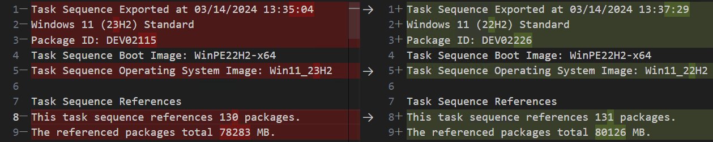
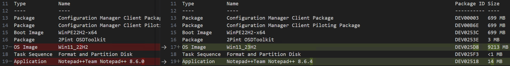
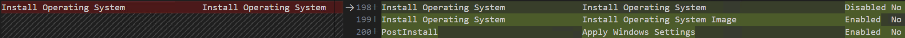
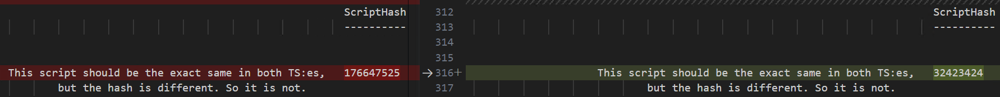
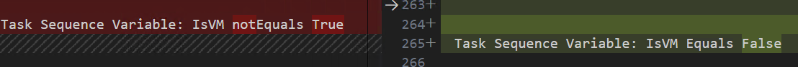
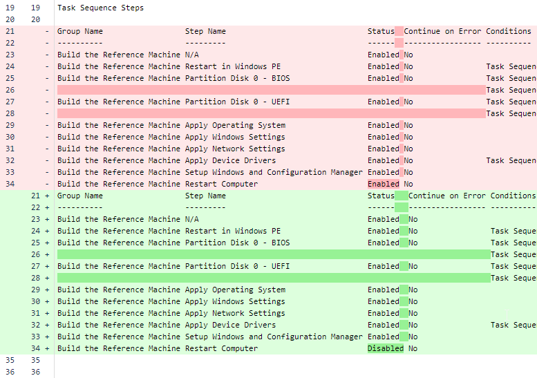

# 📜 Version Control of Configuration Manager Task Sequences


## 🌟 Introduction

I have been searching for ways to document and compare task sequences in my environment. I often find myself making changes in one **test** version of a duplicated **main** task sequence used in production and then merging all changes back into main. This is easy enough with one or two changes, but for large overhauls (especially ones made over time or with multiple team members), it is easy to forget one change. 

Forgot to add one crucial run condition to your new [format disk steps (thanks Mike Terrill)](https://2pintsoftware.com/news/details/format-and-partition-disk---a-reusable-ts-module)? Or maybe you didn't copy over your new **Run Powershell Script** content to the new TS? Hopefully this script can help you.

It bridges that gap by providing a clear, text-based snapshot of task sequences (closely resembling the layout seen in the ConfigMgr console), which can be version-controlled using platforms such as GitHub or Bitbucket.

There is no way to convert the export back into ConfigMgr automatically, it is merely designed to be used as a reference when comparing or modifying task sequences or whenever you need to track down changes made the day something ~~was fixed~~ broke in your TS 🙂

## 🔍 Utilizing the Output

The script's output can be used in two main ways:

- **Direct Comparison**: You can compare two task sequences directly by examining the exported text files. This is useful for quickly identifying changes or discrepancies between different versions of a task sequence. I typically open two similar task sequences in Visual Studio Code (or Notepad++) and run the "compare active file with..." command, selecting both files:

**References** *(applications, packages, boot image, task sequences, etc)*:



**Task sequence steps** differ:



**Script hash** differ


**Conditions** differ:


- **Commit History Tracing**: By pushing the output to a Git repository, you can leverage the commit history to trace the evolution of a task sequence over time. This provides a clear audit trail of what changes were made and when.

In this example, the *Restart Computer* step was **disabled** between commits.


## 📋 Prerequisites

- Windows PowerShell 5.1 or later
- Access to the ConfigMgr console
    - If you want to use the script unattended, I would recommend setting up a service account with the bare minimum rights to read your ConfigMgr task sequences and to query the SMS Provider. 
    - This account would also at minimum need **"logon as batch job"** rights on the system running the script.
- Git installed and configured for Bitbucket or GitHub access *(ssh keys setup, remote added, etc)*

## 💾 Installation

1. Download or clone the script from my GitHub: https://github.com/roenlond/Export-CMTaskSequences
2. Place the script in a directory of your choice on the system with ConfigMgr console access.
3. Set the execution policy to allow the script to run, which can be done via `Set-ExecutionPolicy`
    * If you would like to run it unattended, create a [scheduled task](https://lazyadmin.nl/powershell/how-to-create-a-powershell-scheduled-task/) on the system.

## 🚀 Usage
Default behaviour without pushing to git:

```Powershell
.\Export-CMTaskSequences.ps1 -SMSProvider "SMSProvider.domain.com"
```

Default behaviour and pushing to git:

```powershell
.\Export-CMTaskSequences.ps1 -SMSProvider "SMSProvider.domain.com" -UseGit
```

Exporting a single task sequence only:
```powershell
.\Export-CMTaskSequences.ps1 -SMSProvider "SMSProvider.domain.com" -SpecificTaskSequence "Windows 10 (23H2)"
```
Exporting everything to a specific path:
```powershell
.\Export-CMTaskSequences.ps1 -SMSProvider "SMSProvider.domain.com" -FullExport -OutputPath "C:\ConfigMgrTools\CMTaskSequences"
```
Everything at once, splatted:
```powershell
$params = @{
    SMSProvider              = 'SMSProvider.domain.com'
    RepoPath                = '\\networkShare\Scripts\Export-CMTaskSequences'
    ExclusionPath            = '*Test*'
    useGit                  = $true
    AfterDate                = '2024-02-11 16:00:00'
    customCommitMessage     = 'My Commit Message'
    GitBranch              = 'master'
}

.\Export-CMTaskSequences.ps1 @params
```

All parameters are documented [in the script ](https://github.com/roenlond/Export-CMTaskSequences/blob/cdd569fb1a29c347433d1aa4ea727e2bdf0ae907/Export-CMTaskSequences.ps1#L21) in more detail. 

<hr>

#### Script steps
The script will:
1. Gather all modified task sequences since last run *(or after the date you provide, unless a full export or specific task sequence is specified)*
2. Loop over them, fetching information 
3. Create text files for each task sequence. 

The task sequences will be exported to the same folder you run the script from, in a subfolder called **CMTaskSequences**. In this folder, all task sequences are exported with the same folder structure as your ConfigMgr environment. 

**For example:** if you store your Windows 11 23H2 task sequence in **Task Sequences -> Client -> Standard** in ConfigMgr, the output file would by default be placed in:

```powershell
$RepoPath\CMTaskSequences\Client\Standard\Windows 11 23H2.txt
```

## ⏲️ Automation and Git
You can schedule the script to run at regular intervals using Windows Task Scheduler to keep the repository up-to-date with the latest task sequences changes. How often you want to check for changes is up to you, I run mine each night and on demand. 

The Git commit message is by default just a list of all modified task sequences since last commit. Feel free to change this to whatever you prefer.

## 💬 Notes
By default, the **first run** will export every single task sequence. Every other run will only export task sequences **modified since you last ran the script**. This can be overwritten with the AfterDate parameter shown above.

⚠️ **Be careful you do not include any secrets inside the task sequence in clear text**, for example in a *"run command"* step as this would be exported. Instead, use dynamic variables with *"do not show this value"* set. 

The script will calculate the **hash value** of any PowerShell script steps contained within the task sequences. This feature is useful when you need to verify whether two task sequences have differing scripts that you would expect to be the same. The script content itself is not shown.

The script was tested with ConfigMgr Current Branch 2309 and Bitbucket, with Swedish locale and date format. I have not tested any other combinations so your mileage may vary. I have tried to work in support for most combinations however.

The output format can sometimes act weird in the way the 'columns' (which are really just indented text) are truncated, so some comparisons will not work unless you manually add some spacings where needed. This is something I'd like to improve later.

## 👏 Acknowledgments
This script uses some (slightly modified) functions found in the excellent [DocumentCMCB project](https://github.com/paulwetter/DocumentConfigMgrCB). Huge thanks to the contributors to that project, this would not have been possible without it!

Feel free to reach out on [X/Twitter](https://twitter.com/roenlond) if you have any questions or suggestions.